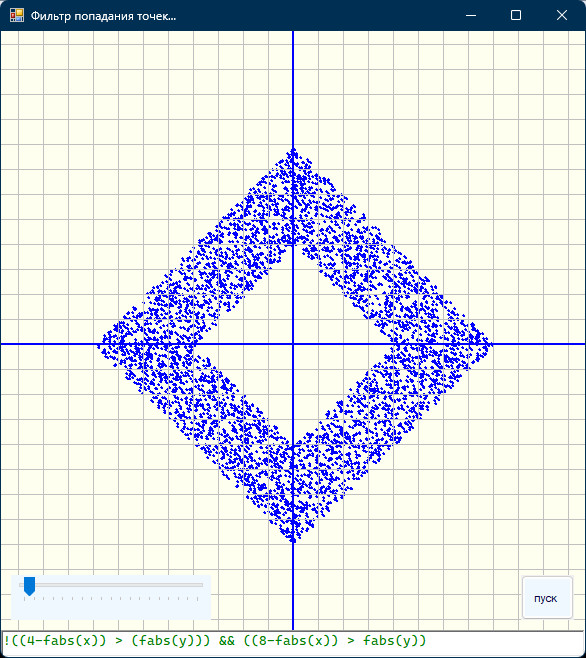
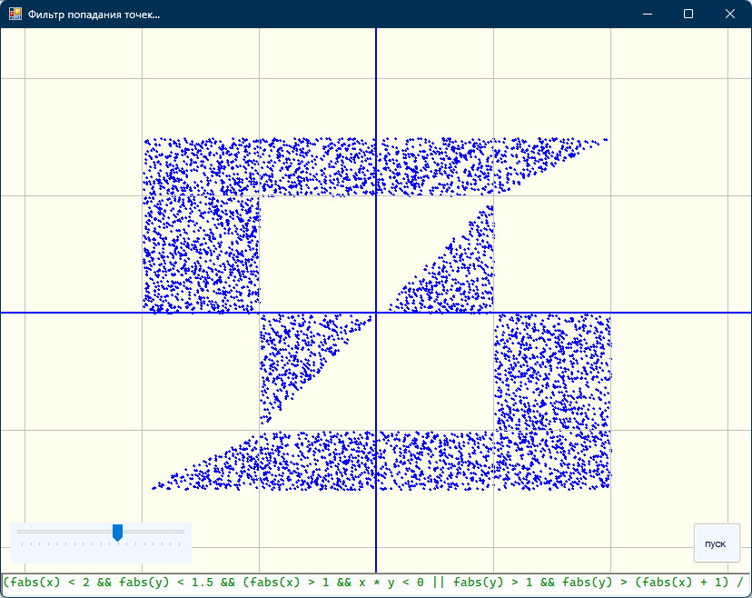

# vsVolga [ТУТОР-2]
  
Внимание!  
Ниже это одна и таже ЗАПУЩЕННАЯ форма со строкой ввода,  
в которую лапками вбивается 3 разных строчных выражения,  
которые возвращают логический(`true/false`) результат.
  
1. Суть задачи можно посмотреть тут:
 https://www.cyberforum.ru/cpp-beginners/thread3017681.html
 
  
  
2. Суть задачи можно посмотреть тут:
https://www.cyberforum.ru/cpp-beginners/thread1199000.html
 
  
  
3. Суть задачи можно посмотреть тут:
https://www.cyberforum.ru/cpp-beginners/thread3148273.html
 
  